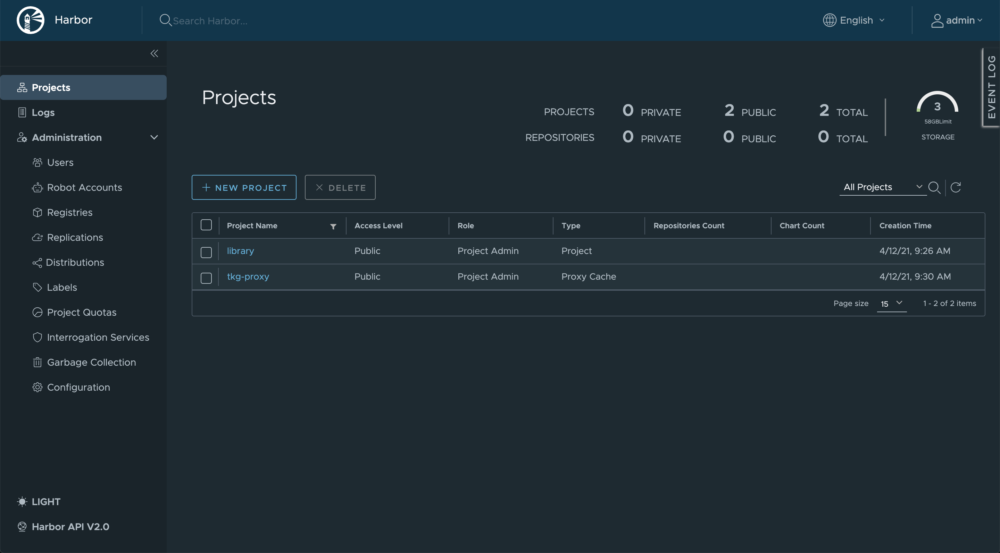

# Terraforming vSphere for Harbor

Use this repository to deploy [Harbor](https://goharbor.io)
to vSphere, leveraging these Terraform scripts.

This Harbor instance could be used as a Docker Hub proxy cache
([no more image rate limitting!](https://www.youtube.com/watch?v=KSH2Hzk-E7U)).
Quite handy when you need to bootstrap your Kubernetes distribution!

## Prerequisites

### Upload Ubuntu OVA to vSphere

Make sure you download the
[Ubuntu Bionic server cloud image OVA](https://cloud-images.ubuntu.com/bionic/current/bionic-server-cloudimg-amd64.ova),
which is used to host the Harbor instance.
You need to upload this OVA to your vSphere instance, and convert it to an OVF template.

### Prepare vSphere infrastructure

Make sure DHCP is enabled: the Harbor VM will get its IP address with DHCP.

The Terraform process requires Internet connectivity,
as Harbor / Docker are downloaded and installed in the VM.
You may however rely on a HTTP proxy that you can specify
in the Terraform configuration (see below).

### Create a self-signed certificate

Unless you already have a certificate for your Harbor instance, you'll likely need
to generate a self-signed certificate. Here's how:

```bash
$ HARBOR_HOSTNAME=harbor.local
$ openssl req -x509 -newkey rsa:4096 -sha256 -days 3650 -nodes -keyout tls.key -out tls.crt -extensions san -config <(echo "[req]"; echo distinguished_name=req; echo "[san]"; echo subjectAltName=DNS:$HARBOR_HOSTNAME,DNS:charts.$HARBOR_HOSTNAME) -subj "/CN=$HARBOR_HOSTNAME"
```

You'll need to create a DNS entry for your Harbor instance later on, using the hostname
you've just used for the self-signed certificate.

You end up with 2 files: `tls.key` and `tls.crt`. Copy those files to this directory.

### Create Terraform configuration

Starting from `terraform.tfvars.tpl`, create new file `terraform.tfvars`:

```yaml
vsphere_password = "changeme"
vsphere_server   = "vcsa.mydomain.com"

cluster       = "vmware"
datacenter    = "cluster"
vm_folder     = "vms"
resource_pool = "harbor"
network       = "VM Network"
datastore     = "LUN01"

# Set HTTP proxy configuration (uncomment to enable proxy support).
#http_proxy_host = "192.168.0.1"
#http_proxy_port = 8080

harbor_hostname       = "harbor.local"
harbor_admin_password = "changeme"

# Run these commands to generate a self-signed TLS certificate:
# $ HARBOR_HOSTNAME=harbor.local
# $ openssl req -x509 -newkey rsa:4096 -sha256 -days 3650 -nodes -keyout tls.key -out tls.crt -extensions san -config <(echo "[req]"; echo distinguished_name=req; echo "[san]"; echo subjectAltName=DNS:$HARBOR_HOSTNAME,DNS:charts.$HARBOR_HOSTNAME) -subj "/CN=$HARBOR_HOSTNAME"
harbor_tls_cert_file = "tls.crt"
harbor_tls_key_file  = "tls.key"
```

As you can see in the template configuration, you may want to enable HTTP proxy support.
These settings will be used to download dependencies such as Docker daemon
and the Harbor installer.

## Bootstrap the Harbor VM

First, initialize Terraform with required plugins:

```bash
$ terraform init
```

Run this command to create the Harbor VM using Terraform:

```bash
$ terraform apply
```

At the end of this process, you can retrieve the VM IP address:

```bash
$ terraform output harbor_ip_address
10.160.28.120
```

You may connect to the Harbor VM with SSH using account `ubuntu`.

Don't forget to **create a DNS entry** matching the Harbor hostname and the VM IP address:
this is how you should connect to your Harbor instance.

## Connect to your Harbor instance

You're good to go! Open your browser at `https://${HARBOR_HOSTNAME}`, and
connect to your Harbor instance as user `admin`, using the password set in
the Terraform configuration file.

Enjoy!



## Contribute

Contributions are always welcome!

Feel free to open issues & send PR.

## License

Copyright &copy; 2021 [VMware, Inc. or its affiliates](https://vmware.com).

This project is licensed under the [Apache Software License version 2.0](https://www.apache.org/licenses/LICENSE-2.0).
